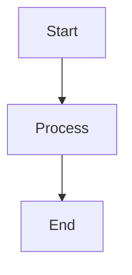
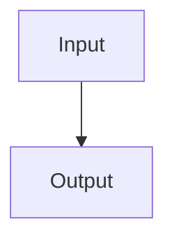

# Test Mermaid Auto-Fix

## Broken Mermaid (should be auto-fixed)

```mermaid
flowchart TD
    A[Start] --> B[Process]
    B --> C[End]
```

## Proper Mermaid (should stay as-is)

```mermaid
graph TD
    D[Input] --> E[Output]
```

## Text content
Regular markdown content here.