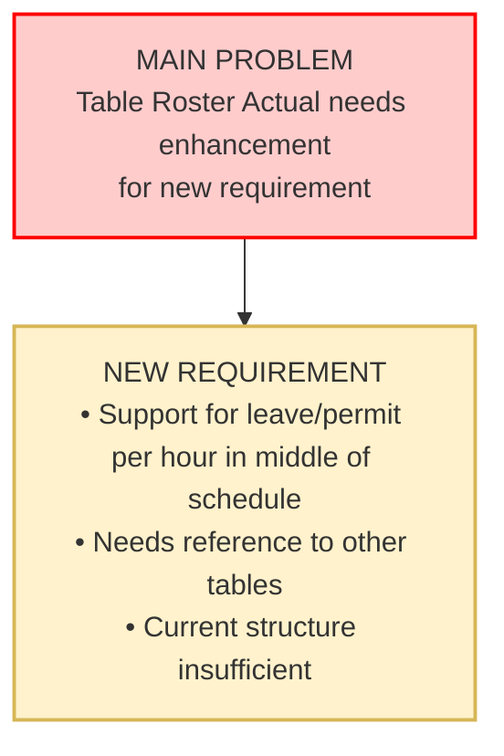
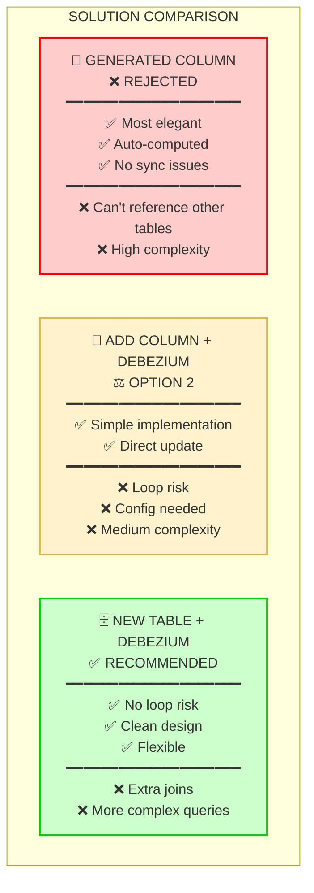

# Roster Actual Table Enhancement New Table & Debezium Solution

## 📊 **PROBLEM DIAGRAM**

**📊 Mermaid Diagram:**

```mermaid
flowchart TD
    A[MAIN PROBLEM<br/>Table Roster Actual needs enhancement<br/>for new requirement] --> B[NEW REQUIREMENT<br/>• Support for leave/permit per hour in middle of schedule<br/>• Needs reference to other tables<br/>• Current structure insufficient]
    
    style A fill:#ffcccc,stroke:#ff0000,stroke-width:2px
    style B fill:#fff2cc,stroke:#d6b656,stroke-width:2px
```

## 🎯 **SOLUTION OPTIONS COMPARISON**

**📊 Mermaid Diagram:**

```mermaid
graph TB
    subgraph "SOLUTION COMPARISON"
        A["🔧 GENERATED COLUMN<br/>❌ REJECTED<br/>━━━━━━━━━━━━━━━━━━━━<br/>✅ Most elegant<br/>✅ Auto-computed<br/>✅ No sync issues<br/>━━━━━━━━━━━━━━━━━━━━<br/>❌ Can't reference other tables<br/>❌ High complexity"]
        
        B["📝 ADD COLUMN + DEBEZIUM<br/>⚖️ OPTION 2<br/>━━━━━━━━━━━━━━━━━━━━<br/>✅ Simple implementation<br/>✅ Direct update<br/>━━━━━━━━━━━━━━━━━━━━<br/>❌ Loop risk<br/>❌ Config needed<br/>❌ Medium complexity"]
        
        C["🗄️ NEW TABLE + DEBEZIUM<br/>✅ RECOMMENDED<br/>━━━━━━━━━━━━━━━━━━━━<br/>✅ No loop risk<br/>✅ Clean design<br/>✅ Flexible<br/>━━━━━━━━━━━━━━━━━━━━<br/>❌ Extra joins<br/>❌ More complex queries"]
    end
    
    style A fill:#ffcccc,stroke:#ff0000,stroke-width:2px
    style B fill:#fff2cc,stroke:#d6b656,stroke-width:2px
    style C fill:#ccffcc,stroke:#00cc00,stroke-width:2px
```